# Google OAuth Login Flow with Ory Kratos

## Overview

This document provides a detailed explanation of the Google OAuth authentication flow implemented in the RBAC POC using Ory Kratos. The flow demonstrates how users authenticate with their Google accounts and how user identity data is managed through Kratos.

## Architecture Components

- **Web App** (localhost:3000): Node.js/Express application providing the user interface
- **Ory Kratos** (localhost:4433): Identity management and authentication service
- **Google OAuth** (accounts.google.com): OAuth 2.0 provider for authentication
- **User Browser**: Client interface for the authentication flow

## Sequence Diagram

```mermaid
sequenceDiagram
    participant User as 👤 User
    participant Browser as 🌐 Browser
    participant WebApp as 📱 Web App<br/>(localhost:3000)
    participant Kratos as 🔐 Ory Kratos<br/>(localhost:4433)
    participant Google as 🔍 Google OAuth<br/>(accounts.google.com)

    Note over User, Google: 1. Initial Access
    User->>Browser: Navigate to http://localhost:3000
    Browser->>WebApp: GET /
    WebApp->>Kratos: GET /sessions/whoami
    Kratos-->>WebApp: 401 Unauthorized (no session)
    WebApp-->>Browser: Show login page with "Sign in with Google"
    Browser-->>User: Display login page

    Note over User, Google: 2. Login Initiation
    User->>Browser: Click "Sign in with Google"
    Browser->>WebApp: GET /login
    WebApp->>Kratos: GET /self-service/login/browser
    Kratos-->>WebApp: 303 Redirect to /login?flow=<flow-id>
    WebApp-->>Browser: 303 Redirect to /login?flow=<flow-id>
    
    Note over User, Google: 3. Login Flow Processing
    Browser->>WebApp: GET /login?flow=<flow-id>
    WebApp->>Kratos: GET /self-service/login/flows?id=<flow-id>
    Kratos-->>WebApp: Login flow data with Google OIDC form
    WebApp-->>Browser: Render login form with Google button
    Browser-->>User: Show "Sign in with Google" form

    Note over User, Google: 4. OAuth Initiation
    User->>Browser: Submit Google OAuth form
    Browser->>Kratos: POST /self-service/login?flow=<flow-id><br/>provider=google&csrf_token=<token>
    Kratos->>Kratos: Generate OAuth state & PKCE
    Kratos-->>Browser: 303 Redirect to Google OAuth
    
    Note over User, Google: 5. Google Authentication
    Browser->>Google: GET /o/oauth2/v2/auth?<br/>client_id=<client-id>&<br/>redirect_uri=localhost:4433/callback&<br/>state=<state>&scope=email+profile
    Google-->>Browser: Show Google login page
    Browser-->>User: Google authentication form
    
    User->>Browser: Enter Google credentials
    Browser->>Google: POST credentials
    Google->>Google: Validate credentials
    Google-->>Browser: 303 Redirect with auth code
    
    Note over User, Google: 6. OAuth Callback
    Browser->>Kratos: GET /self-service/methods/oidc/callback/google?<br/>code=<auth-code>&state=<state>
    Kratos->>Google: POST /oauth2/v4/token<br/>Exchange code for tokens
    Google-->>Kratos: Access token + ID token
    
    Note over User, Google: 7. User Data Mapping
    Kratos->>Google: GET /oauth2/v2/userinfo<br/>Bearer <access-token>
    Google-->>Kratos: User profile data<br/>{email, given_name, family_name, picture}
    Kratos->>Kratos: Apply Jsonnet mapper:<br/>std.extVar('claims') → identity.traits
    Kratos->>Kratos: Create/update identity<br/>Create session
    
    Note over User, Google: 8. Success Redirect
    Kratos-->>Browser: 303 Redirect to http://localhost:3000/<br/>Set-Cookie: ory_kratos_session=<session-id>
    Browser->>WebApp: GET / (with session cookie)
    WebApp->>Kratos: GET /sessions/whoami<br/>Cookie: ory_kratos_session=<session-id>
    Kratos-->>WebApp: 200 OK with user identity data
    WebApp-->>Browser: Dashboard with user profile
    Browser-->>User: Welcome page with Google profile info

    Note over User, Google: 🎉 User is now authenticated!

    rect rgb(240, 248, 255)
        Note over User, Google: Key Components:
        Note over WebApp: Web App: Session check & UI
        Note over Kratos: Kratos: Identity & OAuth flow
        Note over Google: Google: OAuth provider
    end
```

<details>
<summary>Expand to view the sequence diagram</summary>



[![](https://mermaid.ink/img/pako:eNqVV91u2zYUfhVOF26C2pL8E9sV7ASpkxVZtiZolhYYAhi0RMtEJFGlKCdukNsBA7ah-7nvzV5gr7Qn6CPskJQc2bISxxcWKZ3v6JzvfDyk7gyXecRwjIR8TEnkkiOKfY7DqwjBL8ZcUJfGOBLoMiEc4QR9_fLHP2pSNnnN2c3S6tfP-bxs-IFMDuNY2_31r5wimA8m3NrfCZiLgxlLhNO2bXu3DD7lWLBEg__-jM74Iru1ju902u0N-DeM-QHJ8L_l07PDVMy0B-y6LI1EYvrqkemyENxoR2-ZIIjNIUlJQT1DO6hpopOICooDdOi6JEm0uTRq7O9nRDjoLZ5TH4MLwdBMiNixrNV8NSyzB6RmykFvjn9Eln6ob8EznXX2LIF3UhYl1s2M4ZBqU23RKPjp2E10GWHIlXH6iXhoJ2Iow-6u-C-GfTFjNyhgPo2ASZ-gGypm6Mq4oH6E4J6aaiaujNUMwMulcnFEkzjAi4KXpyhtmeh7ZayJFRDhZlJHAXWvtwtnjVAVzOOsBtMGAOfUJdramhRFXSa4bbfRO-JRTlwhq6xRB9OA3QwH8r9Bvf1Kop-Bfpy8dk7etwBC55xJTdLIf5qOx0J9mh0JSw6ot-6gTJQOT1ohDwtcrBo6OzkaoSnjYSVR70jkQdJaTdJyBT9JhcjVUlKiEnOFWrKXPs5tx9Td4klhXqSTkIqVDlPI6qEIOannZxcbWV0riepSMWdzChQMdZOquQmfjgW7JtFwoC6rxBcqRyLCZQvS8SRCjmvo_HR0vF6qSlkWM9pGjXtmDpEIEkEvLtD2QERur9TFLCb7VMuatyw5OFB5uwEF_FgqTA8lIzX1iGcRjlNOh6vbgAWTYILda22pkh4O1GW_lrgsJkMSYhq8BFqnFJSgAtPhlDthlkuxlW1UWr7TrORcUMBm1RxHAgjMsC4kJbE4SKrIUqop2WWxP5i9xwH1ZK2rTCsLrlaITALJs8I29e7mK2SU0V6l-HIbCQlsTV5iMeq5y6pZWuSZAiCI4UDG05BDqF-xmmuqXyFpKaiOpZaIcnd8685wBJuadCaLg9SzEjd5yHp710boJTo50sNtaOmZ-hR1JPvdDziOlw25FK9eAUv9pwCj0ZSpiF8TzMHLAKtIGsXVXg5XvTBTtWq0ysWdUnsd-XROonGEQ1JHUzg2BItsElNXpJzcVzQRaMfBAn2XsCgiAoWQCqgmW1qeSW7Fe8x3XrgBpmHyYhf99_OfiCrRiYUpOKYiqXA84gSqaKWxkmqOUZ71o_ywsg3ffRNasC5XLuatW9zG05mlArkgojFi7JrCKxhfjK-Vt3EWGAhRDx42v4rtFu2olZWZg_6ky91nHPI0Lc-JpLwNt2wbnZ3qNS5VtuRciaVy_z3CyWzCMPcKyJXeWWqGH0gAB2lSOEBmLS4Xp9T3U1vv1y-__6IlTRMUQSsu9FbifZPDVRG5P9lpdew6anX68Le3l1H7mP9TskAjFsYsAqeJswmQE5d9tMCWkNdvRuAYWkOXJ5tgeR3z60lOcy0_GMDuvgm47AjZVVvn279GwGEIUhdXwqgbPqee4QiekroREg7rHKbGnTS8MoCsEI45Dgw9MsVpIOQJ-R5g8Gn0E2NhjuQs9WeGM4VNAmZ6OWafhsu7XJ3BRvJbyXBae8qH4dwZtzB71TPbzW6z86rdbba7drNuLAyn2bfNnt1pN9vNfm-v17I793Xjk3qrbfa7TdvugxzbvWa_1e3d_w-_g-Sh?type=png)](https://mermaid.live/edit#pako:eNqVV91u2zYUfhVOF26C2pL8E9sV7ASpkxVZtiZolhYYAhi0RMtEJFGlKCdukNsBA7ah-7nvzV5gr7Qn6CPskJQc2bISxxcWKZ3v6JzvfDyk7gyXecRwjIR8TEnkkiOKfY7DqwjBL8ZcUJfGOBLoMiEc4QR9_fLHP2pSNnnN2c3S6tfP-bxs-IFMDuNY2_31r5wimA8m3NrfCZiLgxlLhNO2bXu3DD7lWLBEg__-jM74Iru1ju902u0N-DeM-QHJ8L_l07PDVMy0B-y6LI1EYvrqkemyENxoR2-ZIIjNIUlJQT1DO6hpopOICooDdOi6JEm0uTRq7O9nRDjoLZ5TH4MLwdBMiNixrNV8NSyzB6RmykFvjn9Eln6ob8EznXX2LIF3UhYl1s2M4ZBqU23RKPjp2E10GWHIlXH6iXhoJ2Iow-6u-C-GfTFjNyhgPo2ASZ-gGypm6Mq4oH6E4J6aaiaujNUMwMulcnFEkzjAi4KXpyhtmeh7ZayJFRDhZlJHAXWvtwtnjVAVzOOsBtMGAOfUJdramhRFXSa4bbfRO-JRTlwhq6xRB9OA3QwH8r9Bvf1Kop-Bfpy8dk7etwBC55xJTdLIf5qOx0J9mh0JSw6ot-6gTJQOT1ohDwtcrBo6OzkaoSnjYSVR70jkQdJaTdJyBT9JhcjVUlKiEnOFWrKXPs5tx9Td4klhXqSTkIqVDlPI6qEIOannZxcbWV0riepSMWdzChQMdZOquQmfjgW7JtFwoC6rxBcqRyLCZQvS8SRCjmvo_HR0vF6qSlkWM9pGjXtmDpEIEkEvLtD2QERur9TFLCb7VMuatyw5OFB5uwEF_FgqTA8lIzX1iGcRjlNOh6vbgAWTYILda22pkh4O1GW_lrgsJkMSYhq8BFqnFJSgAtPhlDthlkuxlW1UWr7TrORcUMBm1RxHAgjMsC4kJbE4SKrIUqop2WWxP5i9xwH1ZK2rTCsLrlaITALJs8I29e7mK2SU0V6l-HIbCQlsTV5iMeq5y6pZWuSZAiCI4UDG05BDqF-xmmuqXyFpKaiOpZaIcnd8685wBJuadCaLg9SzEjd5yHp710boJTo50sNtaOmZ-hR1JPvdDziOlw25FK9eAUv9pwCj0ZSpiF8TzMHLAKtIGsXVXg5XvTBTtWq0ysWdUnsd-XROonGEQ1JHUzg2BItsElNXpJzcVzQRaMfBAn2XsCgiAoWQCqgmW1qeSW7Fe8x3XrgBpmHyYhf99_OfiCrRiYUpOKYiqXA84gSqaKWxkmqOUZ71o_ywsg3ffRNasC5XLuatW9zG05mlArkgojFi7JrCKxhfjK-Vt3EWGAhRDx42v4rtFu2olZWZg_6ky91nHPI0Lc-JpLwNt2wbnZ3qNS5VtuRciaVy_z3CyWzCMPcKyJXeWWqGH0gAB2lSOEBmLS4Xp9T3U1vv1y-__6IlTRMUQSsu9FbifZPDVRG5P9lpdew6anX68Le3l1H7mP9TskAjFsYsAqeJswmQE5d9tMCWkNdvRuAYWkOXJ5tgeR3z60lOcy0_GMDuvgm47AjZVVvn279GwGEIUhdXwqgbPqee4QiekroREg7rHKbGnTS8MoCsEI45Dgw9MsVpIOQJ-R5g8Gn0E2NhjuQs9WeGM4VNAmZ6OWafhsu7XJ3BRvJbyXBae8qH4dwZtzB71TPbzW6z86rdbba7drNuLAyn2bfNnt1pN9vNfm-v17I793Xjk3qrbfa7TdvugxzbvWa_1e3d_w-_g-Sh)
</details>

## Detailed Flow Description

### Step 1: Initial Access
**User visits the application**
- User navigates to `http://localhost:3000`
- Web app checks for existing session by calling Kratos `/sessions/whoami`
- No session found (401 Unauthorized)
- Web app displays login page with "Sign in with Google" button

### Step 2: Login Initiation
**User initiates login process**
- User clicks "Sign in with Google" button
- Web app redirects to `/login` endpoint
- Web app calls Kratos to initialize login flow
- Kratos creates a new login flow with unique ID and redirects back

### Step 3: Login Flow Processing
**Web app processes the login flow**
- Browser requests login page with flow ID
- Web app fetches login flow data from Kratos
- Kratos returns form configuration including Google OIDC provider
- Web app renders login form with Google OAuth button and CSRF token

### Step 4: OAuth Initiation
**User submits OAuth form**
- User submits the Google OAuth form
- Request includes provider=google and CSRF token
- Kratos generates OAuth state parameter and PKCE challenge for security
- Kratos redirects browser to Google's OAuth authorization endpoint

### Step 5: Google Authentication
**User authenticates with Google**
- Browser redirected to Google OAuth page with client_id, redirect_uri, state, and scopes
- Google displays authentication form
- User enters Google credentials
- Google validates credentials and generates authorization code
- Google redirects back to Kratos callback URL with authorization code

### Step 6: OAuth Callback
**Kratos processes OAuth callback**
- Google redirects to Kratos callback endpoint with authorization code and state
- Kratos validates state parameter to prevent CSRF attacks
- Kratos exchanges authorization code for access token and ID token
- Google returns tokens to Kratos

### Step 7: User Data Mapping
**Kratos creates user identity**
- Kratos uses access token to fetch user profile from Google
- Google returns user data (email, given_name, family_name, picture)
- Kratos applies Jsonnet mapper to transform Google claims to identity traits
- Kratos creates or updates user identity in database
- Kratos creates new session for the user

### Step 8: Success Redirect
**User redirected to application**
- Kratos redirects user back to web app with session cookie
- Browser makes request to web app with session cookie
- Web app validates session by calling Kratos `/sessions/whoami`
- Kratos returns user identity data
- Web app displays dashboard with user's Google profile information

## Security Features

### CSRF Protection
- CSRF tokens prevent cross-site request forgery attacks
- Each login flow includes a unique CSRF token
- Tokens must be included in form submissions

### OAuth State Parameter
- Prevents authorization code interception attacks
- Kratos generates unique state for each OAuth request
- State is validated on callback to ensure request authenticity

### PKCE (Proof Key for Code Exchange)
- Adds additional security layer for OAuth flow
- Prevents authorization code interception in public clients
- Uses code challenge and verifier mechanism

### Session Management
- Secure HTTP-only session cookies
- Session validation on each request
- Automatic session expiration

### Claims Mapping
- Controlled transformation of Google user data
- Jsonnet mapper ensures only specified fields are stored
- Prevents injection of malicious data

## Configuration Files

### Kratos Configuration (`config/kratos.yml`)
- Defines Google as OIDC provider
- Specifies redirect URIs and scopes
- References Jsonnet mapper for claims transformation

### Claims Mapper (`config/google-claims-mapper.jsonnet`)
```jsonnet
local claims = std.extVar('claims');

{
  identity: {
    traits: {
      email: claims.email,
      first_name: claims.given_name,
      last_name: claims.family_name,
      picture: claims.picture,
    },
  },
}
```

### Identity Schema (`config/identity.schema.json`)
- Defines structure for user identity traits
- Specifies email as required field and identifier
- Includes optional fields for name and picture

## Error Handling

### Common Error Scenarios
1. **Invalid OAuth state**: Prevents CSRF attacks
2. **Expired login flow**: Automatic redirect to new flow
3. **Google authentication failure**: User redirected to error page
4. **Claims mapping errors**: Detailed error messages in logs
5. **Session validation failures**: Automatic redirect to login

### Error Flow
- Errors redirect to `/error?id=<error-id>`
- Error details can be fetched from Kratos error endpoint
- Web app can display user-friendly error messages

## Testing the Flow

### Prerequisites
1. Google OAuth client configured in Google Cloud Console
2. Kratos running with proper configuration
3. Web application running on localhost:3000

### Test Steps
1. Navigate to `http://localhost:3000`
2. Click "Sign in with Google"
3. Complete Google authentication
4. Verify redirect to dashboard with profile information
5. Test logout functionality

### Verification Points
- Check Kratos logs for successful OAuth flow
- Verify session cookie is set
- Confirm user identity is created in Kratos
- Validate profile data mapping from Google claims

## Troubleshooting

### Common Issues
1. **Redirect URI mismatch**: Ensure Google Console URIs match Kratos configuration
2. **Environment variables**: Verify Google client credentials are properly set
3. **Claims mapping errors**: Check Jsonnet syntax and base64 encoding
4. **CORS issues**: Ensure proper CORS configuration in Kratos
5. **Session problems**: Verify cookie settings and domain configuration

### Debug Commands
```bash
# Check Kratos health
curl http://localhost:4433/health/ready

# View Kratos logs
docker-compose logs kratos

# Test login flow
curl -v http://localhost:4433/self-service/login/browser

# Check error details
curl "http://localhost:4433/self-service/errors?id=<error-id>"
```

## Related Documentation

- [Google OAuth Setup Guide](google-oauth-setup.md)
- [Kratos Configuration Guide](kratos-configuration.md)
- [Environment Variables Guide](environment-variables.md)
- [Ory Kratos Documentation](https://www.ory.sh/docs/kratos/)
- [Google OAuth 2.0 Documentation](https://developers.google.com/identity/protocols/oauth2)
